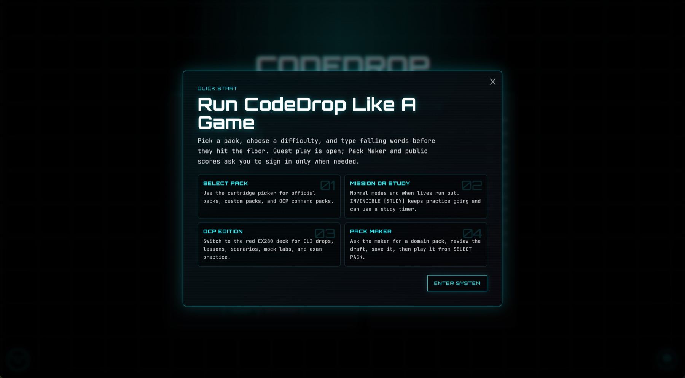
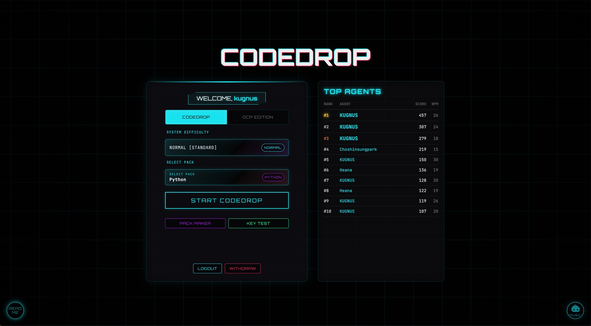
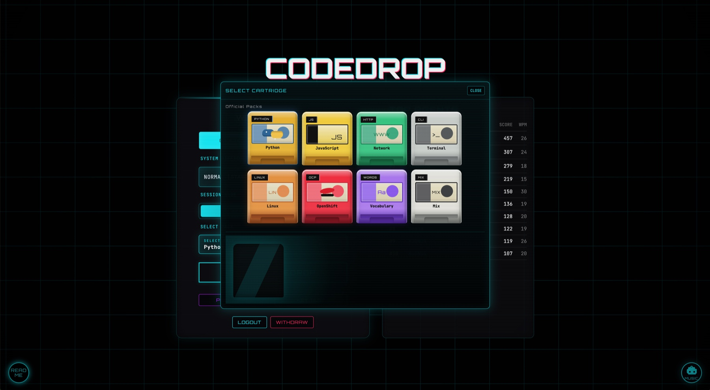
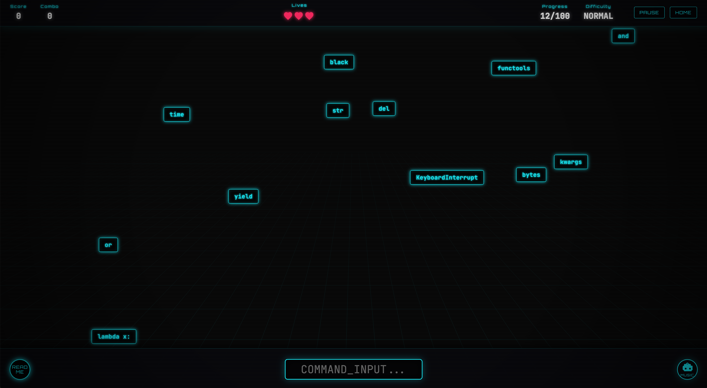
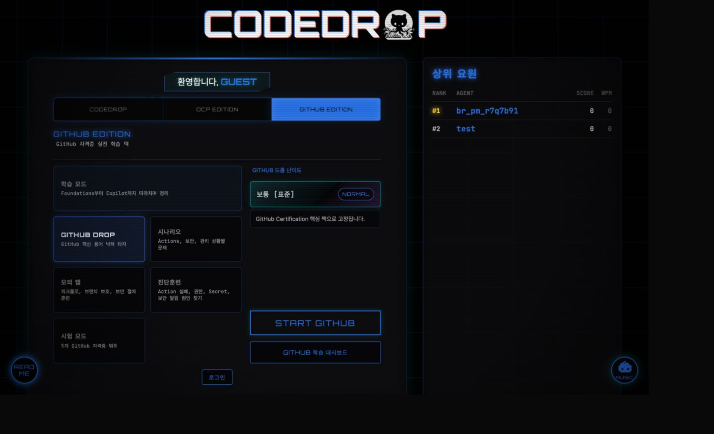
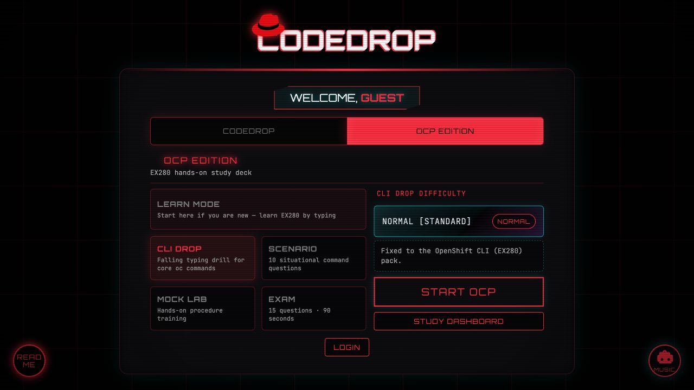
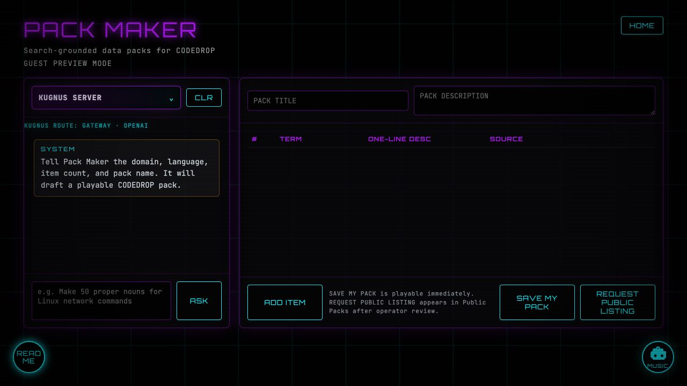
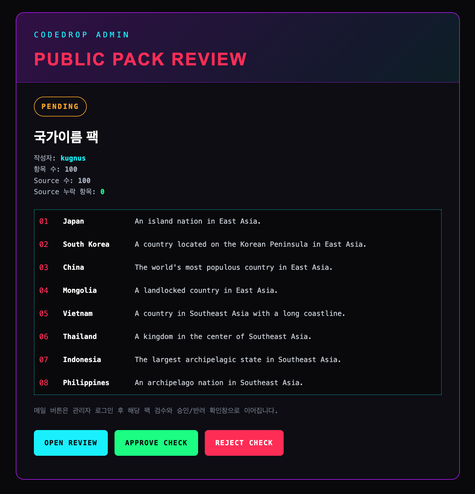

# CodeDrop

Play now: https://www.kugnus.com/games/codedrop/

**Cyberpunk typing drills, EX280 practice, GitHub practice, and AI-made custom word packs.**

CodeDrop began as a falling-code typing game. It is now a compact study system:
official typing packs for muscle memory, an OCP Edition for EX280 hands-on
practice, a GitHub Edition for practical GitHub workflows, and a Pack Maker that
turns natural-language topics into playable data packs through KUGNUS SERVER,
Gemini, or GPT fallback.

The production app is a Node/Express service with MySQL-compatible storage.
The frontend stays guest-first: players can open the app and play official DROP
packs immediately, while server-backed features such as Pack Maker generation,
saved packs, public pack listing, and score upload ask for login only when needed.

## Why It Exists

CodeDrop is for the awkward but very real moment where learning development also
means getting comfortable with a keyboard. A lot of people are more fluent on
phones than PCs now, so the original DROP mode turns programming words, shell
commands, and domain terms into a game that trains finger placement before code
starts feeling intimidating.

OCP Edition is also personal: site owner **Kim Sung-uk** built it because he
wanted OpenShift / EX280 study to feel less like punishment and more like a game.
This kind of nerdy fun is exactly the point.

GitHub Edition extends that idea to everyday development work: Git basics, PR
review, branch protection, Actions, security/admin routines, and Copilot are
learned as a hands-on sequence instead of a pile of docs to memorize.

## Product Screens

### Quick Start Tutorial



### Main Menu and Leaderboard



### SELECT PACK Cartridge Picker



Pack Maker outputs become playable cartridges in the same SELECT PACK flow as
the official packs, so a generated domain pack can move straight into DROP play.

### Original CODEDROP



### GitHub Edition



GitHub Edition uses a blue Octocat-flavored control surface for practical Git,
pull request, Actions, security, administration, and Copilot study.

### OCP Edition



### Pack Maker



Pack Maker is not only for private practice packs. A signed-in player can submit
a generated pack for public release, and the operator reviews it before it joins
the global pack list for everyone.

### Public Pack Review



Public submissions arrive as operator review mail with pack metadata, a source
coverage check, sample rows, and direct review actions for approve/reject.

## Highlights

- **DROP typing game**: neon falling-word gameplay with official packs,
  custom packs, study/invincible difficulty, score, combo, WPM, and pack-specific
  leaderboards.
- **OCP Edition**: EX280-focused Learn Mode, CLI DROP, Scenario, Mock Lab, Exam,
  Study Dashboard, and an OCP chat assistant.
- **GitHub Edition**: practical GitHub Learn curriculum, GitHub DROP, Scenario,
  Mock Lab, Incident Drill, Exam, and Study Dashboard. The course starts with
  Git basics and PR review, then moves through repository guardrails, Actions,
  security/admin operations, and Copilot.
- **Pack Maker**: search-grounded data-pack drafting, editable term/description
  table, private pack save, user-submitted public pack requests, operator review
  mail, and generated packs that appear in the SELECT PACK cartridge picker.
- **LLM choices**: KUGNUS SERVER is the default for the official/owner setup.
  Public clones can use Gemini Flash or GPT mini by adding their own API keys.
- **Guest-first UX**: official packs and screens are explorable without account
  creation; protected actions show contextual login prompts.
- **Retro control surface**: README manual, MUSIC island player, keyboard tester,
  first-run tutorial, and EN/KOR product language support.

## Current Verified Flow

Before shipping a release candidate, verify these gates:

```bash
npm run verify
curl http://localhost:3001/ready
curl http://localhost:3001/api/llm/kugnus/health
npm run doctor:full -- --base-url=http://127.0.0.1:3001
```

Expected:

- `npm run verify` passes.
- `/ready` returns `{"server":"ok","db":"ok"}`.
- KUGNUS health returns `{ "ok": true, ... }`.
- `doctor:full` runs static checks, server/DB readiness, release diagnostics, and the real KUGNUS Pack Maker E2E. It may still report `BLOCKED` for release if gateway/session/origin env is not configured.
- Browser E2E proves Pack Maker generation, save, SELECT PACK selection, DROP
  play, OCP Learn chat, GitHub Learn/DROP, README, MUSIC, and console errors.
- Use `npm run doctor:release -- --base-url=<deployed-or-local-url> --env-file=<release-env-file>` as the fail-fast release gate. It exits non-zero on `FAIL` or `BLOCKED`.

## Local Setup

```bash
npm install
cp .env.local.example .env.local
npm run db:local:up
npm start
```

Open:

```text
http://localhost:3001
```

Check readiness:

```bash
curl http://localhost:3001/ready
```

Expected:

```json
{"server":"ok","db":"ok"}
```

Reset local DB:

```bash
npm run db:local:reset
```

## Environment

Environment templates are committed only as generic guides:

- `.env.local.example`: local Docker/MySQL development defaults.
- `.env.production.example`: deployment checklist with placeholder public URLs.
- `.env.kugnus-gateway.example`: owner/private KUGNUS gateway reference.

Do not commit real `.env`, `.env.local`, production env files, API keys, admin
emails, or deployment-specific domains.

Generate the production session secret with:

```bash
npm run release:secret
```

Minimum local DB variables:

```env
DB_HOST=127.0.0.1
DB_PORT=3307
DB_USER=codedrop
DB_PASSWORD=codedrop_pw
DB_NAME=codedrop_db
DB_SSL=false
SESSION_SECRET=codedrop-local-dev-session-secret-change-for-release
ALLOWED_ORIGINS=http://localhost:3001,http://127.0.0.1:3001
PACK_ADMIN_NICKNAMES=admin
DEFAULT_CHAT_ENGINE=kugnus
```

KUGNUS SERVER is the default for the official/owner setup. It is an
owner-operated LLM path, so public clones should not expect to connect by only
changing the endpoint. CodeDrop prefers the canonical `KUGNUS_GATEWAY_*`
variables for that owner/private path:

```env
# KUGNUS_GATEWAY_BASE_URL=https://llm.example.com/v1
# KUGNUS_GATEWAY_API_KEY=<KUGNUS_GATEWAY_API_KEY>
# KUGNUS_GATEWAY_MODEL=gemma4:12b-it-qat
```

`KUGNUS_CHAT_MODEL` is accepted as an alias for `KUGNUS_GATEWAY_MODEL` when
copying values from the owner/private gateway config. The KUGNUS reference
template is `.env.kugnus-gateway.example`.

For public clones without KUGNUS access, use Gemini or OpenAI instead:

```env
GEMINI_API_KEY=<GEMINI_API_KEY>
GEMINI_MODEL=gemini-2.5-flash
GEMINI_TIMEOUT_MS=120000
```

OpenAI is separate and mini-only:

```env
OPENAI_API_KEY=<OPENAI_API_KEY>
OPENAI_MODEL=gpt-5.4-mini
```

Pack Maker search and future embedding/RAG settings:

```env
DUCKDUCKGO_API_KEY=<DUCKDUCKGO_API_KEY>
EMBEDDING_MODEL=embeddinggemma:latest
EMBEDDING_DIMENSIONS=768
```

`KUGNUS_EMBED_MODEL` is accepted as an alias for future embedding/RAG wiring.

The server rejects non-mini OpenAI models for chat fallback. Keep high-end models out of this app path.

## KUGNUS Routing

The server resolves KUGNUS from exactly one contract:
`KUGNUS_GATEWAY_BASE_URL`, `KUGNUS_GATEWAY_API_KEY`, and
`KUGNUS_GATEWAY_MODEL` or its gateway alias `KUGNUS_CHAT_MODEL`.
`OPENAI_*` is GPT fallback only. Direct Ollama/private environment names are
intentionally not part of the app contract anymore.

`npm run verify` includes `scripts/verify_kugnus_gateway_contract.mjs`, which
starts a fake OpenAI-compatible KUGNUS gateway and proves the explicit
`KUGNUS_GATEWAY_*` path. You can also run that contract directly:

```bash
npm run verify:kugnus-gateway
```

After real gateway env values are present, run a live gateway check before release:

```bash
npm run verify:kugnus-live -- --env-file=.env.production
npm run verify:release-runtime -- --env-file=.env.production
```

Passing output must include:

```json
{
  "kugnusGatewayLive": "ok",
  "model": "gemma4:12b-it-qat"
}
```

`verify:release-runtime` must report `route` as `gateway`.

## Pack Maker QA Prompt

Baseline prompt:

```text
자동차 정비소에 취직하는데 한글로된 자동차정비에 자주등장하는 자동차부품 단어 50개만 뽑아서 카 파츠 팩 만들어줘
```

Passing criteria:

- title is `카 파츠 팩`.
- exactly 50 rows.
- Korean terms are present in all rows.
- no duplicate terms.
- sources are attached.
- `SAVE MY PACK` succeeds.
- saved pack appears in SELECT PACK.
- DROP uses the custom pack terms.
- typed custom term shows score/combo update and description toast.

## Scripts

```bash
npm start              # Run server
npm run verify         # Full static/content/server smoke verification
npm run verify:5x      # Repeat verification
npm run verify:db      # Local DB E2E: register, custom pack, score, withdraw
npm run verify:packmaker:kugnus
                       # Real KUGNUS E2E: vague prompt gate + 50 Korean auto-parts pack + save + custom leaderboard
npm run doctor:local   # Fast local runtime doctor; skips deployment env preflight
npm run doctor:local:full
                       # Local product doctor: deep checks + KUGNUS Pack Maker, skips deployment env preflight
npm run doctor:full     # Deep system doctor plus release preflight; BLOCKED until production env is filled
npm run doctor:release  # Fail-fast doctor for release gates; exits non-zero on FAIL/BLOCKED
npm run doctor:release:full
                       # Fail-fast release gate; runs slow Pack Maker E2E only after preflight passes
npm run verify:docker # Build the production Docker image and probe /health
npm run release:secret # Print a random SESSION_SECRET for deployment env
npm run release:check  # Fail-fast release environment preflight
npm run db:local:up    # Start local MySQL
npm run db:local:down  # Stop local MySQL
npm run db:local:reset # Reset local MySQL data
```

## Deployment Notes

Current official production-compatible shape:

```text
Node/Express server
MySQL-compatible DB
KUGNUS owner/private gateway
Gemini or GPT mini fallback
```

KUGNUS routing must go through the configured gateway contract. Public clones
that do not operate this gateway can use Gemini or OpenAI API keys instead.

Render/Docker deployment is described by `render.yaml` at the repository root.
It builds the checked-in `Dockerfile`, probes `/health`, and waits for CI checks
before auto-deploying. Deployment-specific values are intentionally `sync: false`
so Render prompts for them instead of storing production URLs, DB credentials, or
API keys in git.

Before syncing the Render Blueprint, fill these in the Render environment UI:

```text
DB_HOST, DB_PORT, DB_USER, DB_PASSWORD, DB_NAME, DB_SSL
SESSION_SECRET
ALLOWED_ORIGINS
PACK_ADMIN_NICKNAMES
KUGNUS_GATEWAY_BASE_URL
KUGNUS_GATEWAY_API_KEY
OPENAI_API_KEY
DUCKDUCKGO_API_KEY
```

`KUGNUS_GATEWAY_BASE_URL` must be a reachable HTTPS gateway URL, not a Tailscale,
localhost, or direct Ollama address.

### Deploy under a subpath

CodeDrop is prepared to live under a public subpath like:

```text
https://codedrop.example.com/games/codedrop/
```

The app uses browser routes below that base path, for example:

```text
/games/codedrop/
/games/codedrop/pack-maker
/games/codedrop/key-test
/games/codedrop/ocp
/games/codedrop/ocp/dashboard
/games/codedrop/ocp/scenario
/games/codedrop/github
/games/codedrop/github/learn
/games/codedrop/github/play
/games/codedrop/github/dashboard
```

All of those paths must serve the CodeDrop app. The backend already returns
`index.html` for `/games/codedrop/*`, serves assets under
`/games/codedrop/js`, `/games/codedrop/assets`, and `/games/codedrop/sound`,
and accepts API/auth calls under the same base path so the game can coexist with
the main site on the same host.

If a public web host is a reverse proxy in front of this Node service, route the
game base path to the CodeDrop backend:

```text
/games/codedrop/*                  -> CodeDrop backend
/games/codedrop/api/*              -> CodeDrop backend
/games/codedrop/login              -> CodeDrop backend
/games/codedrop/register           -> CodeDrop backend
/games/codedrop/withdraw           -> CodeDrop backend
/games/codedrop/submit             -> CodeDrop backend
/games/codedrop/leaderboard        -> CodeDrop backend
```

Keep the root `/health` and `/ready` endpoints available on the backend service
for platform health checks. They do not need to be public pages on
the main site.

Example Nginx shape:

```nginx
location ^~ /games/codedrop/ {
    proxy_pass https://codedrop-backend.example.com;
    proxy_set_header Host $host;
    proxy_set_header X-Forwarded-Proto $scheme;
}
```

Example Caddy shape:

```caddyfile
handle /games/codedrop/* {
    reverse_proxy https://codedrop-backend.example.com
}
```

Do not use `handle_path` for this route unless you also rewrite the path back to
`/games/codedrop/*`; direct browser routes such as `/games/codedrop/pack-maker`
must arrive at the backend with the base path intact.

For the example domain above, production `ALLOWED_ORIGINS` should include
exactly:

```text
https://codedrop.example.com
```

Firebase migration target:

```text
Firebase Hosting  -> static UI
Firebase Auth     -> anonymous/member identity
Firestore         -> profiles, leaderboards, pack metadata
Cloud Functions   -> Pack Maker search, KUGNUS/GPT calls, private API keys
```

Do not move LLM keys or DuckDuckGo/search credentials into browser code.

See `FIREBASE_MIGRATION.md` before starting the migration. It lists the exact
Firebase Console inputs, Firestore collections, rules boundaries, server API
layer, and E2E gates required before Firebase can replace the current release
shape.

Run release preflight before deploying the current Node backend:

```bash
DEPLOY_TARGET=node npm run release:check
```

To validate a filled production env file locally before entering values in the deployment dashboard:

```bash
RELEASE_ENV_FILE=.env.production DEPLOY_TARGET=node npm run release:check
```

When `RELEASE_ENV_FILE` or `--env-file` is provided, release tooling treats that
file as authoritative and lets it override stale shell environment values. This
keeps local/Tailscale KUGNUS settings from leaking into a production preflight.

This intentionally fails if release env does not provide a public `https://` KUGNUS gateway. For a future Firebase release:

```bash
DEPLOY_TARGET=firebase npm run release:check
```

That target requires `firebase.json`, `.firebaserc` with the real Firebase
project id, `firestore.rules`, and a Functions/Cloud Run API layer for KUGNUS,
DuckDuckGo, Pack Maker, and private keys.

When a release preflight fails, inspect the JSON `nextActions` field first. It is
the deployment punch list, not just a generic error dump.

## System Doctor

Use the doctor command when the local app feels inconsistent and you need a single evidence report:

```bash
npm run doctor
```

The output groups checks as `PASS`, `SKIPPED`, `WARN`, `BLOCKED`, or `FAIL`.
It reports the active KUGNUS route and DB readiness. Use the local variants
when you want product/runtime evidence without deployment env noise:

```bash
npm run doctor:local
npm run doctor:local:full
```

`doctor:local` and `doctor:local:full` mark `release.preflight` as `SKIPPED`;
that is expected. `doctor:local:full` includes the slow real KUGNUS Pack Maker
50-item E2E.

For release candidates, use the strict variants so `BLOCKED` cannot be missed:

```bash
npm run doctor:release -- --base-url=http://127.0.0.1:3001 --env-file=.env.production
npm run doctor:release:full -- --base-url=http://127.0.0.1:3001 --env-file=.env.production
```

`doctor:release` fails the command when the app is still using local direct KUGNUS, missing the configured KUGNUS gateway, missing production session/origin values, or running a server route that does not match the configured release route.
Strict release doctor stops at a blocked release preflight before running slow or mutating local E2E checks, so the first failing deployment condition stays visible.

## Product Rules

CodeDrop's public product contract is:

- Keep the first screen guest-first. Official packs and edition screens stay
  explorable without account creation.
- Ask for login only when a server-backed action needs identity, such as Pack
  Maker generation/save, public review submission, custom pack ranking, official
  score upload, or account deletion.
- Show contextual login prompts for guest-limited actions instead of raw session
  errors.
- Keep ENG/KOR language state product-wide for menus, descriptions,
  placeholders, CTAs, and feature-gating popups.
- Keep KUGNUS SERVER as the official/owner default LLM path, with Gemini/OpenAI
  available for public clones through their own API keys.
